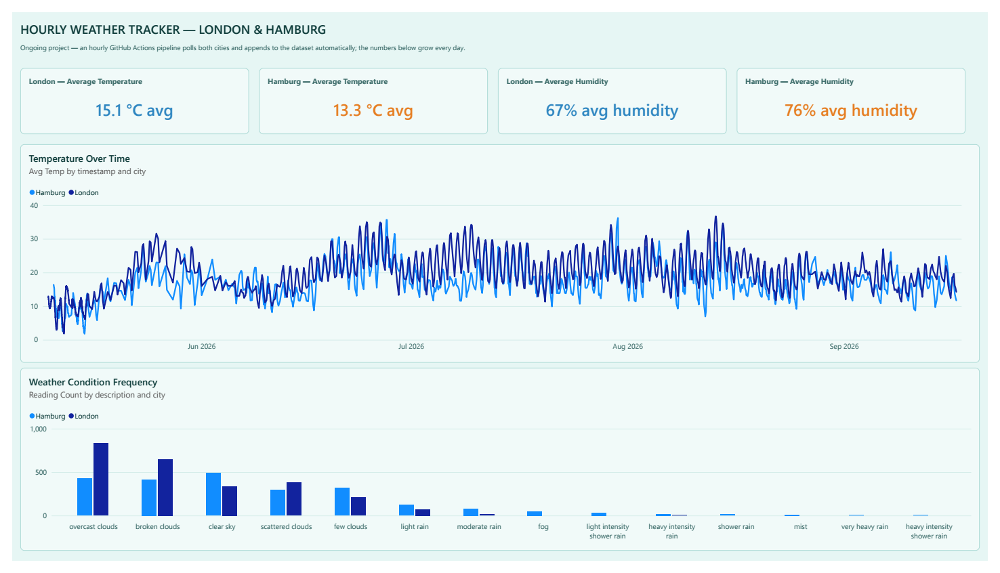

# 🌦️ Hourly Weather Data Tracker

This repository hosts an automated data pipeline that tracks and logs weather conditions for **London** and **Hamburg**. It serves as the data foundation for future sentiment and environmental analysis.

> **Status: ongoing.** The GitHub Action keeps polling and appending hourly,
> so the dataset (and the numbers in the dashboard below) grow every day —
> this isn't a finished, fixed-size dataset like the rest of this account's
> Power BI projects.

---

## 📈 Dashboard

`weather-tracker.pbip` — a small, single-page report since the dataset is
still short (a few thousand rows so far): average temperature and humidity
for each city, a temperature-over-time line chart, and a weather-condition
frequency breakdown. Kept deliberately simple rather than over-building a
dashboard for data that's still accumulating. Light turquoise theme, easier
on the eyes than a plain white report background.

---

## 🚀 How it Works

* **Automation:** A GitHub Action workflow triggers every hour (via `cron`) or on-demand (via `workflow_dispatch`).
* **Data Collection:** A Python script fetches real-time metrics from the **OpenWeather API**.
* **Persistent Storage:** Data is automatically appended to `overnight_weather.csv` and committed back to the repository by the GitHub Action Bot.
* **Environment:** The pipeline runs on an `ubuntu-latest` runner using **Python 3.12**.

---

## 📊 Data Structure

The dataset is stored in `overnight_weather.csv` with the following columns:

| Column | Description |
| :--- | :--- |
| **timestamp** | Date and time of data retrieval (UTC) |
| **city** | The city being tracked (London or Hamburg) |
| **temp_c** | Current temperature in Celsius |
| **humidity_pct** | Humidity level as a percentage |
| **pressure** | Atmospheric pressure (hPa) |
| **wind_speed** | Wind speed in meters/second |
| **description** | Short weather condition summary (e.g., "broken clouds") |

---

## 🛠️ Tech Stack

* **Language:** Python 3.12
* **Libraries:** `requests`, `pandas`
* **CI/CD:** GitHub Actions
* **API:** OpenWeatherMap API

---

## 🛡️ Setup & Security

1.  **Secrets:** The API key is stored securely in GitHub Actions Secrets as `OPENWEATHER_API_KEY`.
2.  **Environment:** The project uses `PYTHONUNBUFFERED` logging to ensure live tracking of the execution within GitHub's runner logs.
3.  **Safe CSV Handling:** The `.gitignore` is configured to ignore local temporary files while allowing the central data CSV to be updated by the automation.
